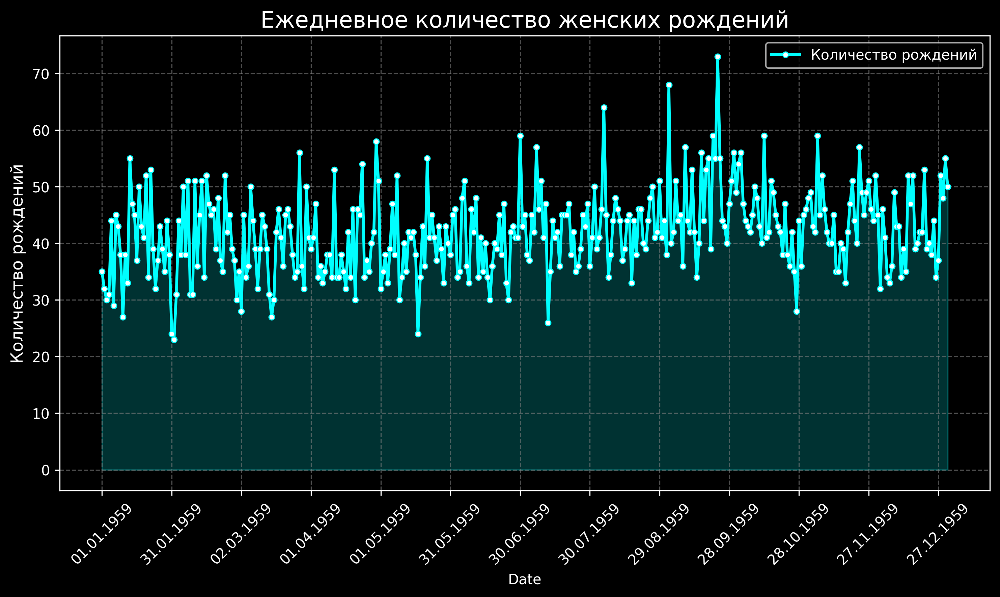
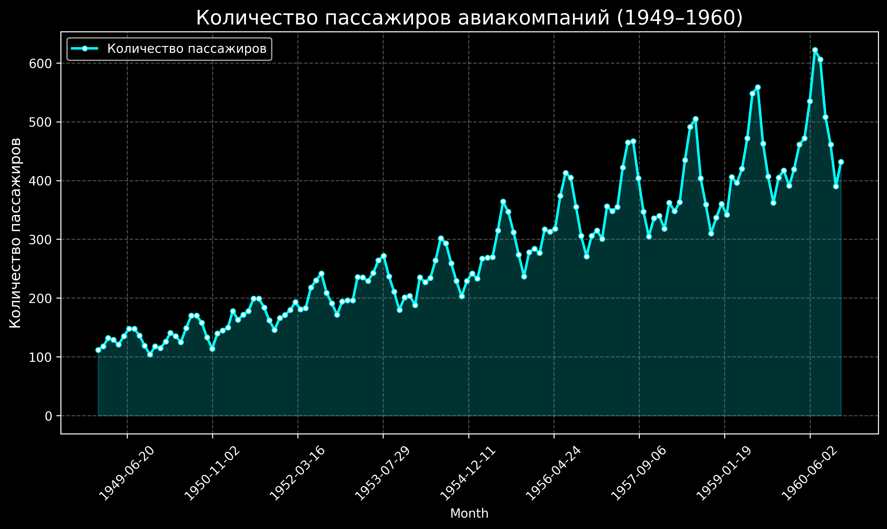
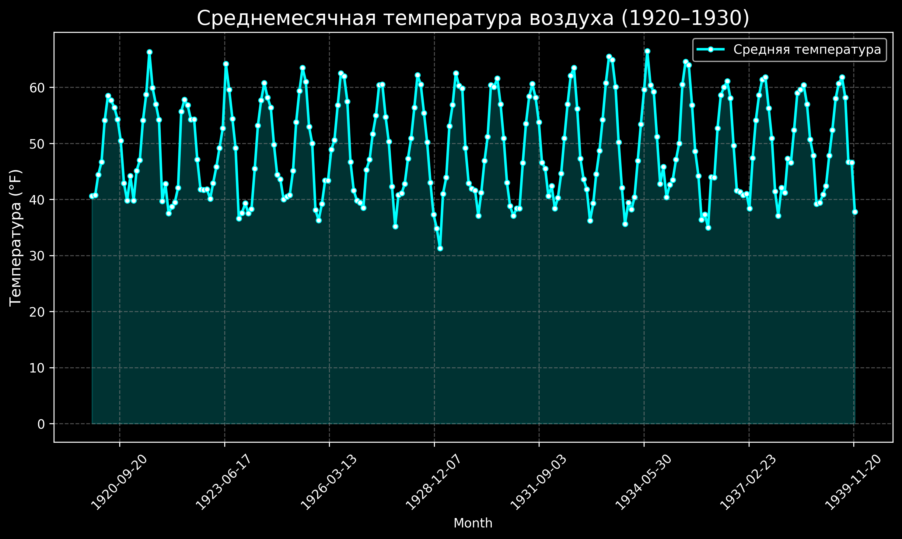

# Анализ временных рядов
Данный репозиторий представляет собой анализ различных датасетов содержащих данные об определенном факторе и её распределении по определенному временному ряду.

## Содержание
1. [Описание общих понятий](#описание-общих-понятий)
2. [Установка зависимостей](#установка-зависимостей)
3. [Анализ](#анализ)
- [Ежедневное рождение женщин](#ежедневное-рождение-женщин)
- [Количество пассажиров авиакомпаний](#количество-пассажиров-авиакомпаний)
- [Среднемесячная температура](#среднемесячная-температура)
4. [Результаты](#результаты)

## Описание общих понятий
Временной ряд - это последовательность измерений или наблюдений, упорядоченных во времени, где каждое значение соответствует определённому моменту или интервалу времени.

Примеры временных рядов:

- Ежедневная температура воздуха

- Количество продаж товара по месяцам

- Курс акций на бирже

Стационарность - временной ряд считается стационарным, если его свойства(дисперсия, среднее) НЕ меняются со временем.

Простейщим примером стационарного временного ряда является Белый шум, так как оно обладает нулевым средним, постоянной дисперсией и отсутствием автокорреляции.

## Тесты на стационарность
Для проверки стационарности используются такие тесты, как: Тест КПСС, тест Перрона и тест Дикки-Фуллера

В данной работе используетя именно тест Дикки Фуллера. Данный тест проверяет две гипотезы:
- H_0​: Ряд нестационарен (есть единичный корень)
- H_1: Ряд стационарен

Интерпетация: 
- Если p-value < 0.5, то отвергаем нулевую гипотезу(то есть ряд стационарен)
- В обратном случае, если p-value больше 0.5, то ряд НЕ является стационарным

## Установка зависимостей
В данном анализе используется язык Python и соответствующие библиотеки для анализа данных:
- Pandas - для прочтения данных из CSV файла
- Matplotlib и Seaborn - для визуализации
- Statsmodels - для реализации теста Дикки Фуллера

Для установки данных библиотек использовалась команда:

```bash
pip install pandas matplotlib seaborn statsmodels
```
# Анализ
## One.py
## Ежедневное рождение женщин
Первый датасет представляет собой данные об ежедневное рождение женщин в период с 1 января по 31 декабря 1959 года

Соответственно в csv файле можем увидеть два фактора: сам временной ряд и соответсвующие временному ряду числа
| Date       | Count |
|------------|-------|
| 01.01.1959 | 35,00 |
| 02.01.1959 | 32,00 |
| 03.01.1959 | 30,00 |
| 04.01.1959 | 31,00 |
............. | .............

Для начала импортируем зависимости и данный csv файл:
```bash
import pandas as pd
import matplotlib.pyplot as plt

data = pd.read_csv('datasets/daily-total-female-births-in-cal.csv', delimiter=';', parse_dates=['Date'], )

data.set_index('Date', inplace=True)
```
Также преобразуем числа с плавающей точкой - поскольку Python скорее всего воспримет числа с разделителем в виде запятой неверно, то заменим их на точку:
```bash
data['Count'] = data['Count'].str.replace(',', '.', regex=True)
data['Count'] = data['Count'].astype(float) 
```
Далее проведем тест Дикки Фуллера при нескольких уровнях значимости(1, 5, 10), найдем p-value и определим ряд стационарен или нет: 
```bash
from statsmodels.tsa.stattools import adfuller

result = adfuller(data['Count'])

print('Тест Дики-Фуллера:')
print(f'{result[0]}')
print(f'p-value: {result[1]}')

print('Критические значения:')
for key, value in result[4].items():
    print(f'{key}: {value}')

if result[1] <= 0.05:
    print("Ряд стационарен (отвергаем нулевую гипотезу).")
else:
    print("Ряд нестационарен (не можем отвергнуть нулевую гипотезу).")
```
После выполнения получим следующий результат:
```bash
Тест Дики-Фуллера:
-4.808291253559763
p-value: 5.243412990149865e-05
Критические значения:
1%: -3.448748905151901
5%: -2.8696473721448728
10%: -2.5710891239349585
Ряд стационарен (отвергаем нулевую гипотезу).
```
По результату теста, полученного p-значения, при трёх критических значениях разной строгости можно сказать, что данный ряд НЕ стационарен.

Пояснение: Тест Дики-Фуллера: -4.808291253559763
Данное число меньше всех критических значений (-3.448, -2.869, -2.571).

P-значение: 0.0000524 < 0.05 - меньше 5% уровня значимости, то есть мы отвергаем нулевую гипотезу - Ряд Стационарен

Для определения стационарности также можно осмотреть график

Для этого импортируем необходимые библиотеки и реализуем линейный график:

 

По графику можно видеть, что данные расположены вокург некоторого среднего уровня, и также не имеют явного тренда, т.е. нет роста/падения

Стационарный временной ряд характеризуется тем, что его свойства (среднее значение, дисперсия и автокорреляция) остаются постоянными во времени 

По графику можно понять:
- Временной ряд колеблется примерно в диапазоне от 30 до 70.
Хотя есть небольшие пики, общее среднее значение кажется относительно стабильным на протяжении всего периода.
- Колебания данных имеют примерно одинаковую амплитуду на всём временном интервале.
Это указывает на то, что дисперсия ряда тоже остается стабильной.
- График не показывает долгосрочного тренда (например, систематического увеличения или уменьшения количества рождений).
Это подтверждает отсутствие трендовой компоненты.

По этим данным можно потвердить стационарность.


## Примечание 
В дальнейшем будет отображаться только информация о временных рядах и выводы по ним. Код для всего анализа остается почти неизменным.

Для изучения кода, можно рассмотреть соответствующие файлы отсортированные по порядку возрастания в репозитории.

## Two.py
## Количество пассажиров авиакомпаний

Следующий датасет представляет собой информацию про количество пассажиров авиакомпаний в период с 1949 по 1960.

Проведем тест Дикки-Фуллера, как и в прошлый раз. Также найдем p-значение.

Результат выполнения кода:
```bash
Тест Дики-Фуллера:
0.8153688792060482
p-value: 0.991880243437641
Критические значения:
   1%: -3.4816817173418295
   5%: -2.8840418343195267
   10%: -2.578770059171598
Ряд нестационарен (не можем отвергнуть нулевую гипотезу).
```
## Выводы

0.8153688792060482 это значение значительно больше , чем критические значения (например, -3.48 для уровня значимости 1%, -2.88 для 5% и -2.58 для 10%).

p-значение - 0.9919 значительно больше, чем пороговое значение 0.05, что означает, что мы не можем отвергнуть нулевую гипотезу.


Данные демонстрируют восходящий тренд: общее количество пассажиров увеличивается с течением времени.

По результатам теста и после рассмотрения графика можно по данному датасету сделать вывод, что он НЕ является стационарным

## Three.py
## Среднемесячная температура

Следующий CSV содержит данные о среднемесячной температуре воздуха.

Снова находим p-value и проведем тест Дикки Фуллера при трех уровнях значимости.

Результат:
```bash
Тест Дики-Фуллера:
-3.2554924030863353
p-value: 0.016989030222608687
Критические значения:
   1%: -3.4597521044060353
   5%: -2.874472927517147
   10%: -2.5736628197530864
Ряд стационарен (отвергаем нулевую гипотезу).
```

Далее рассмотрим графическую иллюстрацию:

 
Данные демонстрируют сезонные колебания : температура увеличивается летом и уменьшается зимой, что является типичным для климатических данных.

На графике явно видны регулярные пики и спады , повторяющиеся каждый год:
Пики соответствуют летним месяцам 
Спады наблюдаются в зимние месяцы 

Это указывает на наличие сезонной компоненты , которая делает ряд нестационарным.
Временной ряд считается НЕ стационарным из-за наличия сезонности.

p-value : 0.017

P-value < 0.05, мы можем отвергнуть нулевую гипотезу (H_0) на уровне значимости 5%.

При 1% уровне значимости ряд НЕ стационарен.


# Результаты


| Датасет                                      | Стационарность (уровень 5%) | Особенности                                   |
|----------------------------------------------|-----------------------------|-----------------------------------------------|
| Ежедневное количество женских рождений    | Стационарен                 | Нет тренда или сезонности                     |
| Количество пассажиров авиакомпаний        | Нестационарен               | Тренд                            |
| Среднемесячная температура воздуха       | Стационарен (на уровне 5%)  | Сезонность без тренда                         |